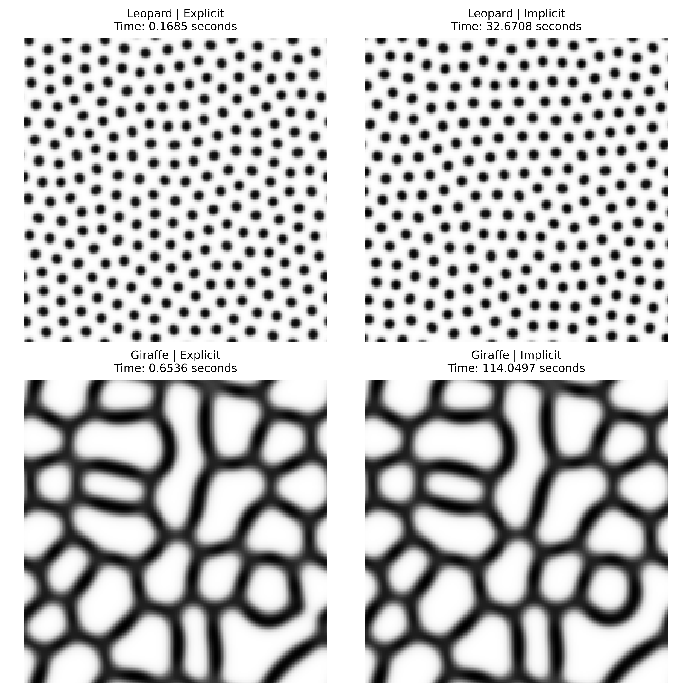

# Turing Pattern Simulator

Simulating animal coat patterns (leopard spots, giraffe stripes) by numerically solving the
Gray–Scott reaction–diffusion system in 2D — with two interchangeable time-integration
schemes and a reproducible convergence-order validation suite.

> Academic project — Computational Sciences M.Sc., Freie Universität Berlin, 2025.
> 7-person team. **My contribution is scoped explicitly [below](#my-contribution).**



*Left column: GPU explicit Euler. Right column: CPU matrix-free Crank–Nicolson. Both schemes
converge to visually equivalent steady states — which is exactly the cross-validation we wanted.*

---

## What this does

The Gray–Scott model describes two chemicals `u` and `v` that diffuse at different rates and
react as `U + 2V → 3V`:

```
∂u/∂t = Du·∇²u − uv² + F(1 − u)
∂v/∂t = Dv·∇²v + uv² − (F + K)v
```

When `Du > Dv`, small random perturbations grow into stable, self-organising spatial
structures — Turing instability. Changing only `F` (feed) and `K` (kill) moves the system
between spot-like and stripe-like regimes:

| Preset | `Du` | `Dv` | `F` | `K` | `dt` | steps | Result |
| --- | --- | --- | --- | --- | --- | --- | --- |
| `leopard` | 0.16 | 0.08 | 0.0367 | 0.0649 | 1.0 | 10,000 | spots |
| `giraffe` | 0.8 | 0.4 | 0.089 | 0.060 | 0.02 | 50,000 | stripes / polygonal cells |

Both run on a 200×200 grid with periodic boundary conditions (toroidal topology).

---

## Two solvers, deliberately compared

The point of the project was not just to produce a pretty picture, but to implement the same
PDE two ways and show that the numerics agree with theory.

|     | Explicit Euler | Crank–Nicolson (IMEX) |
| --- | --- | --- |
| Time accuracy | O(Δt) | O(Δt²) on the diffusion term |
| Space accuracy | O(Δx²) | O(Δx²) |
| Stability | conditional (CFL-limited) | unconditionally stable in diffusion |
| Linear algebra | none | conjugate gradient, **matrix-free** |
| Backend | CUDA kernel via CuPy | NumPy / SciPy on CPU |

### Why matrix-free matters here

A naive Crank–Nicolson implementation assembles `A = I − (Δt/2)·D·L` and factorises it. On a
200×200 grid that operator is **40,000 × 40,000**, and a sparse LU factorisation suffers severe
fill-in — the original prototype (kept in the commented block at the top of
`Implicit.py`) used `scipy.sparse.linalg.factorized` and did not scale.

The shipped version never builds the matrix at all. It registers a `LinearOperator` whose
`matvec` applies the Laplacian directly on the 2-D array via `np.roll`, and solves each step
with conjugate gradient, **warm-started from the previous time step** (`x0=u_vec`). Since
consecutive states differ only slightly, CG converges in very few iterations:

```python
u_next_vec, _ = splinalg.cg(self.A_u_op, rhs_u, x0=u_vec, rtol=1e-5)
```

This turns an intractable factorisation into a solver that handles 50,000 steps on commodity
hardware.

---

## Measured performance

200×200 grid, times from `benchmark_profile.py` (see figure above):

| Pattern | Steps | Explicit (GPU) | Crank–Nicolson (CPU) |
| --- | --- | --- | --- |
| Leopard | 10,000 | **0.17 s** | 32.7 s |
| Giraffe | 50,000 | **0.65 s** | 114.0 s |

The gap is expected and is the point: the explicit scheme is vastly cheaper per step but
CFL-constrained, while Crank–Nicolson buys unconditional stability and higher temporal order at
the cost of an iterative solve per step. Agreement between the two output fields is what
validates both implementations.

---

## Numerical validation

`validate_order.py` empirically measures convergence orders against theory by log–log
regression of the error against step size:

- **Spatial** — the discrete Laplacian is applied to `sin(2πx)·cos(2πy)`, whose exact
  Laplacian is known analytically; measured slope should approach **2**.
- **Temporal** — three configurations compared: explicit Euler on the full model (**O(Δt)**),
  IMEX Crank–Nicolson on the full model (**O(Δt)**, limited by the explicitly-treated reaction
  term), and pure Crank–Nicolson on diffusion only (**O(Δt²)**).

That middle result is the interesting one: splitting the stiff diffusion implicitly while
keeping the nonlinear reaction explicit caps the global order at 1, even though the diffusion
half is second-order. The validation script demonstrates this rather than assuming it.

`turing_core/unittest.py` covers the finite-difference stencil, a single explicit Euler step
against a hand-computed value, the sparse Laplacian construction, and the periodic boundary
wrap-around.

---

## Quick start

```bash
git clone https://github.com/h422900437-boop/turing-pattern-simulator.git
cd turing-pattern-simulator/CompSciProj_PatternFormation_FinalVersion_Code/TuringPattern
pip install -e .
python run_sim.py          # runs all 4 pattern × solver combinations
```

**CPU-only?** The Crank–Nicolson solver has no CuPy dependency. Comment out the `cupy-cuda12x`
line in `requirement.txt` before installing and use `method="implicit"`.

**With a CUDA GPU?** Match the CuPy build to your toolkit — `cupy-cuda12x` for CUDA 12.x,
`cupy-cuda11x` for 11.x. Verify with `python test_cupy.py`.

Programmatic use:

```python
from turing_core.interface import run_simulation
from turing_core.visual import SolverVisualizer

v, elapsed = run_simulation(pattern="giraffe", method="implicit")
SolverVisualizer.show_result(v, elapsed, "Giraffe — Crank-Nicolson")
```

Other entry points: `benchmark_profile.py` (timing + cProfile hot spots),
`validate_order.py` (convergence plots), `test_cupy.py` (GPU diagnostics).

---

## Architecture

The package separates *what* is being solved from *how* it is solved, so a new model or a new
scheme can be added without touching the rest:

```
turing_core/
├── interface.py          # run_simulation(pattern, method) — the only entry point callers need
├── models.py             # Gray-Scott reaction terms + parameter presets
├── solvers/
│   ├── explicit.py       # ExplicitScheme    — CUDA kernel via CuPy RawKernel
│   └── Implicit.py       # CrankNicolsonScheme — matrix-free CG
├── seeding/
│   ├── Leo_seeding.py    # initial condition: ~2% random V nuclei + Gaussian noise
│   └── Giraffe_seeding.py
├── visual.py             # SolverVisualizer
└── unittest.py           # correctness tests
```

Both solver classes expose the same `run() -> (v_field, elapsed)` contract, so
`interface.py` selects between them by string and nothing downstream changes. Parameters live
as data in `models.py` rather than as literals inside the solvers, which is what makes the
benchmark and convergence scripts able to sweep them.

Full documentation — installation troubleshooting, per-parameter reference, algorithm details:
[`CompSciProj_PatternFormation_FinalVersion_Code/TuringPattern/README.md`](CompSciProj_PatternFormation_FinalVersion_Code/TuringPattern/README.md)

`2D-Explicit/` and `Crank-Nicolson-implicit/` hold the earlier standalone prototype scripts,
kept for reference; `TuringPattern/` is the refactored package and the version to read.

---

## My contribution

This was a 7-person course project. To be precise about what is mine:

**I was responsible for:**

- **The initial theoretical framework** — setting up the discretisation of the Gray–Scott
  system, the finite-difference formulation, and the scheme selection that the implementation
  was built on.
- **The OOP architecture** — designing the `turing_core` package layout: the solver interface
  contract, the separation of models / solvers / seeding / visualisation, and the refactor from
  the original standalone scripts into an installable package.
- **The core numerical implementation** — the serial explicit Euler scheme and the matrix-free
  Crank–Nicolson solver (`LinearOperator` + warm-started conjugate gradient described above).
- **Model formulation and parameter calibration** — the Gray–Scott reaction terms and the
  `leopard` / `giraffe` parameter presets that place the system in the spot- and stripe-forming
  regimes.
- **The test suite** — unit tests for the Laplacian stencil, the time-stepping update, and the
  periodic boundary handling.

**Done by other team members:** the CUDA/CuPy parallelisation of the explicit solver, the
extended theoretical analysis, and the written report.

---

## Known limitations

Honest notes for anyone reading the code:

- `turing_core/unittest.py` was written against the pre-GPU explicit solver and its constructor
  signature; it needs updating to run against the current `ExplicitScheme`.
- `setup.py` still contains a placeholder author field and a `console_scripts` entry point
  (`turing-sim`) that points at a module that does not exist. Use `python run_sim.py`.
- The dependency file is named `requirement.txt` (singular) while parts of the documentation
  refer to `requirements.txt`.
- `explicit.py` and `Implicit.py` retain earlier implementations as commented blocks. They are
  useful as a record of the optimisation path (dense→sparse→matrix-free) but should be moved to
  version history rather than kept inline.

---

## References

1. Turing, A. M. (1952). *The Chemical Basis of Morphogenesis*. Phil. Trans. R. Soc. B **237**(641), 37–72.
2. Pearson, J. E. (1993). *Complex Patterns in a Simple System*. Science **261**(5118), 189–192.
3. [CuPy documentation](https://docs.cupy.dev/)

## Team

Julius Merten · Seongmook Lim · Soonjung Kim · Weiqi Li · Guowei Huang ·
Ahmed Hamed Elqamel · Ziheng Guo

Department of Mathematics and Computer Science, Freie Universität Berlin, 2025

## License

MIT — see [`LICENSE`](LICENSE).